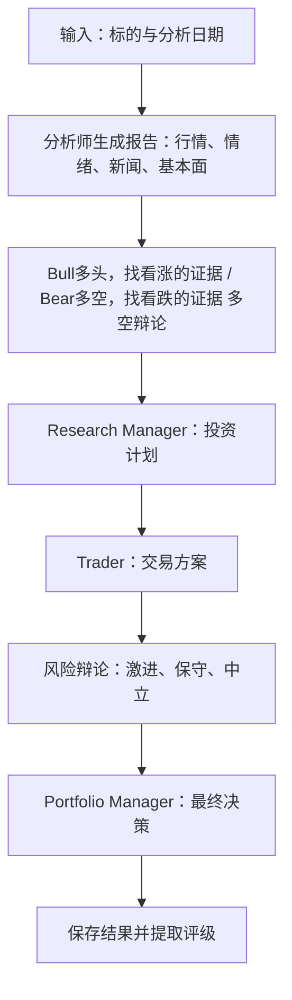

# TradingAgents 项目阅读指南

这份指南帮助你先看懂项目的整体流程，再逐步理解各个 Agent 和数据层。推荐顺序是：**入口 → 流程编排 → 共享状态 → Agent 实现 → 总调度 → 数据来源**。

## JEV 模块阅读入口

JEV 目前是独立决策后端，尚未接入下文的主分析图。一次调用的阅读顺序：

1. [jev_agent.py](tradingagents/agents/jev/jev_agent.py)：`JevAgent.evaluate()` 编排输入、校验、模型调用和信号生成。
2. [models.py](tradingagents/agents/jev/models.py)：`JevMarketState` 输入、`JevTradingSignal` 输出及评分等级。
3. [market_data.py](tradingagents/agents/jev/market_data.py)：将 CSV、JSON、DataFrame、NumPy 数据规范化为可发送的 JSON 数据。
4. [dates.py](tradingagents/agents/jev/dates.py)：日期解析，以及日期列与索引的时间一致性检查。
5. [point_in_time.py](tradingagents/agents/jev/point_in_time.py)：逐行扫描日期并执行日级截止校验；已规范化的数据不重复解析。
6. [jev_client.py](tradingagents/decision_models/jev_client.py) 与 [validation.py](tradingagents/decision_models/validation.py)：SDK 适配和共用数值校验。

原有从 `tradingagents.agents.jev` 或 `jev_agent` 导入模型类及公开辅助函数的方式仍可使用。此次拆分不改变日期截止规则、预测窗口或评分含义。

## 1. 先建立整体地图

项目通过多个 LLM Agent 分工，针对指定标的和分析日期生成报告、讨论投资方向、评估交易方案，最终输出决策。



当前实现中，选中的分析师按顺序运行；分析师可以循环调用工具，两组辩论按照配置的轮数循环。Trader 在这条主流程中生成交易提案。

## 2. 推荐阅读顺序

### 第一步：入口与配置

阅读：

- [main.py](main.py)
- [tradingagents/default_config.py](tradingagents/default_config.py)

先理解最小调用方式：

```python
config = DEFAULT_CONFIG.copy()
ta = TradingAgentsGraph(debug=True, config=config)
final_state, decision = ta.propagate("NVDA", "2026-09-01")
```

输入是标的和分析日期；输出是完整状态 `final_state` 与最终评级 `decision`。当前评级包括 Buy、Overweight、Hold、Underweight、Sell；无法解析时返回 REVIEW。

配置先关注以下几项，其他内容可以暂时略过：

| 配置 | 作用 |
| --- | --- |
| `llm_provider` | 使用哪家模型服务 |
| `quick_think_llm` / `deep_think_llm` | 普通节点与管理决策节点使用的模型 |
| `max_debate_rounds` | 多空辩论轮数 |
| `max_risk_discuss_rounds` | 风险辩论轮数 |
| `data_vendors` / `tool_vendors` | 数据源选择 |
| `output_language` | 报告和最终决策的输出语言 |

**读完应能回答：一次分析需要什么输入，返回什么结果？**

### 第二步：流程如何连接

阅读：

- [graph/setup.py](tradingagents/graph/setup.py)
- [graph/conditional_logic.py](tradingagents/graph/conditional_logic.py)

重点找三个调用：

- `add_node()`：注册一个处理节点。
- `add_edge()`：定义固定的下一步。
- `add_conditional_edges()`：根据状态选择下一步。

关注两类循环：

1. **分析师与工具之间的循环**：模型提出工具调用 → ToolNode 执行 → 回到分析师；没有工具调用后进入后续流程。
2. **辩论循环**：Bull → Bear，或 Aggressive → Conservative → Neutral；达到次数阈值后交给 Manager。

`count` 统计的是发言次数：多空一轮对应两次发言，风险一轮对应三次。节点自身负责发言，图中的条件路由负责换人和结束。

**读完应能回答：谁先运行，谁接着运行，循环何时停止？**

### 第三步：共享状态与数据传递

阅读：

- [agents/utils/agent_states.py](tradingagents/agents/utils/agent_states.py)
- [graph/propagation.py](tradingagents/graph/propagation.py) 的 `create_initial_state()`

`AgentState` 定义流程中的共享数据。Agent 读取所需字段，返回局部更新，再由图将更新合入状态。

| 字段 | 内容及用途 |
| --- | --- |
| `company_of_interest` / `trade_date` | 分析标的与日期 |
| `messages` | 模型与工具交互的消息 |
| `market_report` / `sentiment_report` / `news_report` / `fundamentals_report` | 各类分析报告 |
| `investment_debate_state` | 多空辩论历史、最新发言与计数 |
| `investment_plan` | Research Manager 形成的投资计划 |
| `trader_investment_plan` | Trader 形成的交易方案 |
| `risk_debate_state` | 风险辩论历史、各方发言与计数 |
| `final_trade_decision` | Portfolio Manager 的最终决策 |
| `past_context` / `portfolio_context` | 历史经验与调用方提供的持仓背景 |

**读完应能回答：上一个 Agent 的输出，如何成为下一个 Agent 的输入？**

### 第四步：精读一个分析师

阅读 [agents/analysts/market_analyst.py](tradingagents/agents/analysts/market_analyst.py)。

第一遍可以略读较长的技术指标说明，优先看：

```text
读取 state
→ 定义 tools 和 prompt
→ llm.bind_tools(tools)
→ chain.invoke(...)
→ 检查是否还有 tool_calls
→ 返回 messages 和 market_report
```

结合第二步的图理解：`bind_tools()` 让模型能够提出工具调用，实际执行工具由图中的 ToolNode 完成。模型不再请求工具时，当前回答才作为报告写入 `market_report`。

**读完应能回答：模型如何取得数据，又在什么时候产出报告？**

### 第五步：沿着决策链阅读 Agent

按下面的顺序读，能串起当前打开的辩手文件：

| 顺序 | 文件 | 阅读重点 |
| --- | --- | --- |
| 1 | [bull_researcher.py](tradingagents/agents/researchers/bull_researcher.py) | 读取分析报告和辩论历史，生成看多论点，更新多空辩论状态 |
| 2 | [bear_researcher.py](tradingagents/agents/researchers/bear_researcher.py) | 对照 Bull，关注角色立场与写回字段的区别 |
| 3 | [research_manager.py](tradingagents/agents/managers/research_manager.py) | 综合多空辩论，写入 `investment_plan` |
| 4 | [trader.py](tradingagents/agents/trader/trader.py) | 将投资计划结合技术报告和持仓背景，形成 `trader_investment_plan` |
| 5 | [neutral_debator.py](tradingagents/agents/risk_mgmt/neutral_debator.py) | 读取交易方案、报告及其他风险辩手发言，更新风险辩论状态 |
| 6 | [aggressive_debator.py](tradingagents/agents/risk_mgmt/aggressive_debator.py)、[conservative_debator.py](tradingagents/agents/risk_mgmt/conservative_debator.py) | 与 Neutral 对照，关注风险偏好和角色 prompt |
| 7 | [portfolio_manager.py](tradingagents/agents/managers/portfolio_manager.py) | 综合研究计划、交易方案、风险辩论和背景信息，写入 `final_trade_decision` |

这里是阅读顺序；风险辩论实际发言顺序为 Aggressive → Conservative → Neutral。

建议精读 Bull 和 Neutral，另外三个辩手对照阅读即可。五个辩手基本遵循同一种模板：

```text
读取 state → 构造 prompt → 调用 LLM → 返回 state 更新
```

注意 `create_xxx(llm)` 是创建节点函数的工厂，真正处理状态的是它返回的 `node(state)`。

Manager 和 Trader 还涉及结构化输出；遇到辅助函数时，先理解输入输出，第二遍再看 [schemas.py](tradingagents/agents/schemas.py) 和 [utils/structured.py](tradingagents/agents/utils/structured.py)。

**读完应能回答：投资方向、交易方案和最终决策分别由谁生成？**

### 第六步：回到总调度，串起一次完整运行

阅读 [graph/trading_graph.py](tradingagents/graph/trading_graph.py)，优先定位以下函数：

| 函数 | 阅读重点 |
| --- | --- |
| `__init__()` | 创建模型客户端、工具节点、路由组件，并构建和编译图 |
| `propagate()` | 一次分析的公共入口 |
| `_run_graph()` | 准备状态、执行图、保存结果并返回决策 |
| `create_run_state()` | 将标的信息、历史经验和持仓背景注入初始状态 |
| `process_signal()` | 从最终决策文本中提取评级 |

可以配合阅读 [graph/signal_processing.py](tradingagents/graph/signal_processing.py)：当前评级提取使用确定性解析，不额外调用 LLM。

检查点恢复、历史收益结算和日志细节先跳过，避免打断主线。

**读完应能回答：入口如何把模型、工具、状态和流程图组织起来？**

### 第七步：追踪一条真实的数据调用链

从行情工具入手，按顺序阅读：

1. [agents/utils/core_stock_tools.py](tradingagents/agents/utils/core_stock_tools.py)：暴露给模型的 `get_stock_data` 工具。
2. [dataflows/interface.py](tradingagents/dataflows/interface.py)：`route_to_vendor()` 根据配置选择数据源。
3. [dataflows/y_finance.py](tradingagents/dataflows/y_finance.py)：具体的数据获取实现。

先理解这三层关系：

```text
Agent 请求调用工具
→ 工具处理参数和日期边界
→ 根据配置路由到数据源
→ 数据源实现获取并返回数据
```

**读完应能回答：报告中的数据从哪里来，切换数据源会影响哪一层？**

## 3. 第一遍容易混淆的地方

- **多空辩论与风险辩论是两个阶段**：前者讨论投资方向，后者评估已有交易方案，分别使用不同的 debate state。
- **Neutral 也是辩手**：最终裁判是 Portfolio Manager。
- **Agent 不需要各自定义一个类**：这里大量使用工厂函数返回节点函数。
- **发言内容与流程控制分开**：prompt 决定如何分析，图和条件路由决定谁接着运行。
- **辩手主要消费已有报告**：行情、新闻等数据获取应沿分析师和工具层追踪。
- **消息与业务结果分开存储**：除了 `messages`，还要看报告、计划和辩论历史等字段。

## 4. 第二遍再读的内容

| 想进一步理解的内容 | 对应位置 |
| --- | --- |
| 命令行交互与进度展示 | [cli/main.py](cli/main.py) |
| 不同模型服务的接入 | [llm_clients/factory.py](tradingagents/llm_clients/factory.py) 及该目录下的客户端 |
| 结构化输出与评级定义 | [agents/schemas.py](tradingagents/agents/schemas.py)、[agents/utils/structured.py](tradingagents/agents/utils/structured.py) |
| 历史决策与反思 | [agents/utils/memory.py](tradingagents/agents/utils/memory.py)、[graph/reflection.py](tradingagents/graph/reflection.py) |
| 中断恢复 | [graph/checkpointer.py](tradingagents/graph/checkpointer.py) |
| 回测与评估 | [backtest.py](tradingagents/backtest.py) |
| 持仓背景 | [portfolio.py](tradingagents/portfolio.py) |

想看不依赖真实模型调用的例子，可以读 [tests/test_debate_opening.py](tests/test_debate_opening.py)：它通过模拟 LLM 和构造最小状态，展示辩手节点如何被调用。

## 5. 阅读时的记录模板

每读一个 Agent，只记录以下三项：

```text
Agent 名称：
1. 读取哪些 state 字段？
2. prompt 要求模型完成什么任务？
3. 返回并更新哪些 state 字段？
```

如果能画出完整流程，并沿着状态字段解释一份分析报告如何进入最终决策，就已经掌握了项目的主干。
